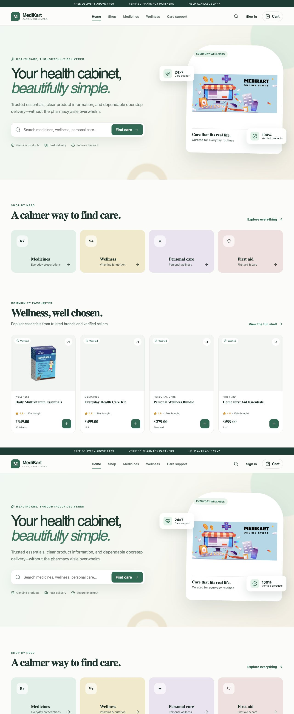
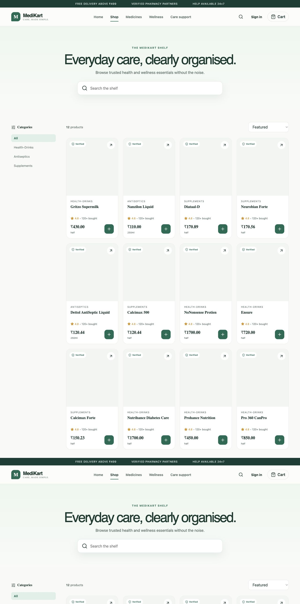
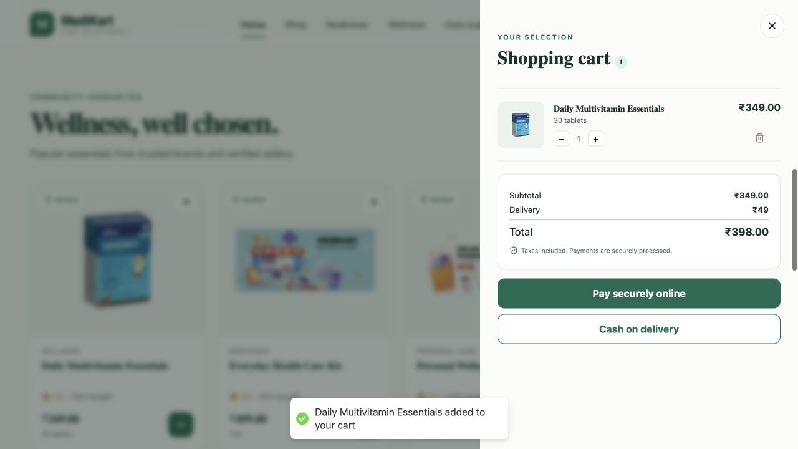
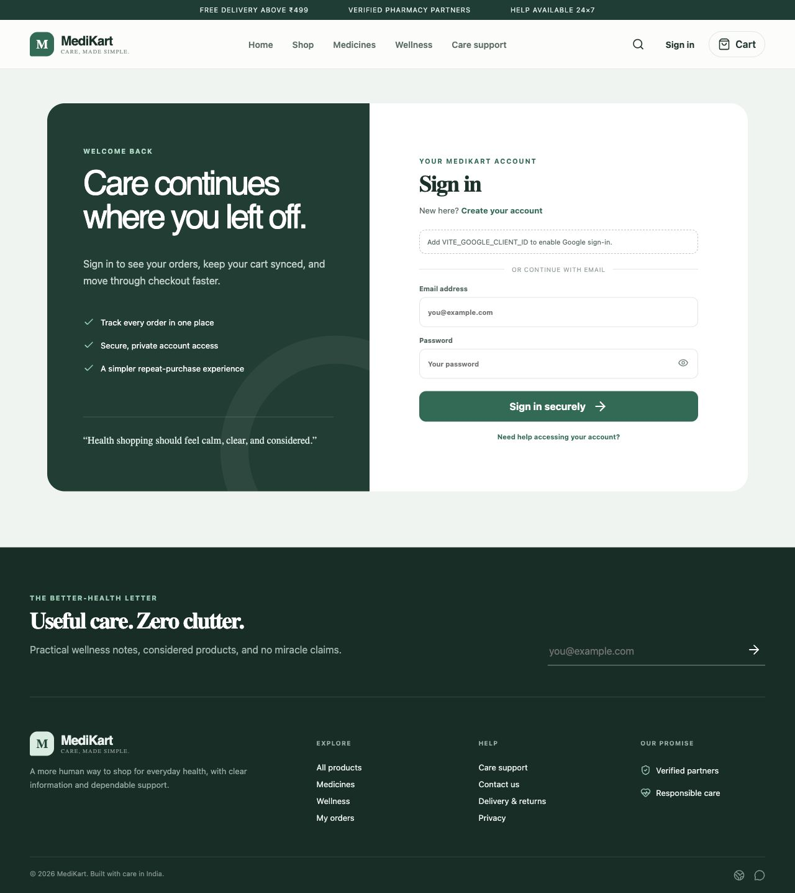
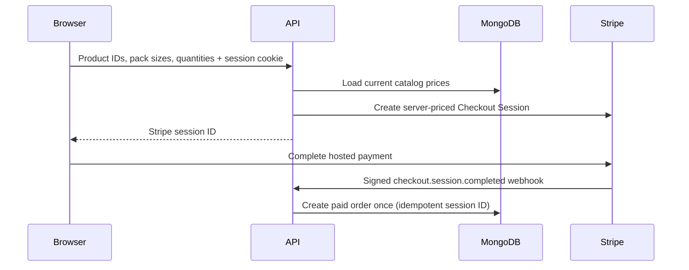

# MediKart

MediKart is a modern MERN health-and-wellness storefront with a responsive product catalog, secure account access, server-priced carts, Stripe Checkout, cash on delivery, and authenticated order history.

[Open the live storefront](https://medikartwebsite.vercel.app/) · [API health endpoint](https://medi-kart.vercel.app/)



## Highlights

- Responsive catalog with 30 locally imaged Wellness and OTC Medicines products, reactive category navigation, search, product details, cart, account, orders, support, and privacy experiences.
- Password and Google Identity sign-in with a seven-day JWT stored in a secure `httpOnly` cookie.
- Server-authoritative product pricing: checkout requests contain only product ID, pack size, and quantity.
- Stripe card orders are fulfilled only after a signed `checkout.session.completed` webhook confirms payment.
- Cash-on-delivery orders are priced and created directly by the authenticated backend.
- One MongoDB document per order with structured line items, totals, status, payment method, and timestamps.
- Auth rate limiting, consistent JSON errors, short-lived catalog caching, security headers, crawler metadata, and optimized WebP assets.
- Automated security tests and GitHub Actions checks for the backend and frontend.

## Screens

| Catalog | Cart |
| --- | --- |
|  |  |

| Account access | Care support |
| --- | --- |
|  |  |

## Secure checkout architecture



The browser never decides the amount charged or marks an online order as paid. Invalid products, pack sizes, and quantities are rejected before a Checkout Session or COD order is created.

## Technology

- Frontend: React, Vite, React Router, Context API, Lucide, React Hot Toast, Google Identity, Stripe.js.
- Backend: Node.js, Express, MongoDB/Mongoose, bcrypt, JWT, Google Auth Library, Stripe, Express Validator, Express Rate Limit.
- Delivery: Vercel frontend/API deployments and GitHub Actions CI.

## Local setup

Requirements: Node.js 20+, npm, a MongoDB database, and test credentials for the integrations you enable.

```bash
git clone https://github.com/aerraj/MediKart.git
cd MediKart

cp backend/.env.example backend/config/config.env
cp frontend/.env.example frontend/.env

cd backend && npm install
cd ../frontend && npm install
```

Use the same Google OAuth Web Client ID for `GOOGLE_CLIENT_ID` and `VITE_GOOGLE_CLIENT_ID`. Add `http://localhost:5173` and your production frontend URL as Authorized JavaScript origins in Google Cloud.

Generate a strong JWT secret instead of using a memorable phrase:

```bash
openssl rand -base64 48
```

Start the applications in separate terminals:

```bash
cd backend && npm run dev
cd frontend && npm run dev
```

The frontend runs at `http://localhost:5173`; the API defaults to `http://localhost:5000`.

Seed or refresh the bundled Wellness and Medicines inventory after configuring `MONGO_URI`:

```bash
cd backend
npm run seed:catalog
```

The seeder upserts products by stable ID or exact product name, is safe to re-run, and does not remove unrelated catalog items. The API also merges the bundled catalog into reads, so a newly deployed storefront has complete categories while the database seed is being applied.

## Stripe webhook setup

For local development, forward Stripe events to the backend and copy the printed signing secret to `STRIPE_WEBHOOK_SECRET`:

```bash
stripe listen --forward-to localhost:5000/api/stripe/webhook
```

In production, configure Stripe to send `checkout.session.completed` to:

```text
https://YOUR_API_DOMAIN/api/stripe/webhook
```

Required production variables are `MONGO_URI`, `JWT_SECRET`, `STRIPE_SECRET_KEY`, `STRIPE_WEBHOOK_SECRET`, `FRONTEND_URL`, and `CORS_ORIGINS`. Google and reCAPTCHA variables are required only when those integrations are enabled.

## API

| Method | Endpoint | Authentication | Purpose |
| --- | --- | --- | --- |
| `POST` | `/api/createUser` | Public, rate limited | Create a password account |
| `POST` | `/api/loginUser` | Public, rate limited | Start a secure cookie session |
| `POST` | `/api/auth/google` | Public, rate limited | Verify Google ID token and start a session |
| `POST` | `/api/logout` | Session | Clear the session cookie |
| `GET` / `POST` | `/api/displayData` | Public | Fetch fresh products and categories |
| `POST` | `/api/orderData` | Required | Create a server-priced COD order |
| `GET` | `/api/myOrderData` | Required | Read the signed-in customer’s orders |
| `POST` | `/api/payment` | Required | Create a server-priced Stripe session |
| `POST` | `/api/stripe/webhook` | Stripe signature | Fulfil a completed card payment |

## Project layout

```text
MediKart/
├── .github/workflows/ci.yml
├── backend/
│   ├── middleware/       # JWT session verification
│   ├── models/           # User, pending checkout, structured order
│   ├── Routes/           # Auth, catalog, orders, payment/webhook
│   ├── services/         # Server-side catalog pricing
│   └── test/             # Node security tests
├── docs/screenshots/     # Current README visuals
└── frontend/
    ├── public/           # Optimized assets and crawler files
    └── src/
        ├── components/
        ├── lib/
        └── screens/
```

## Quality checks

```bash
cd backend
npm test
npm audit --omit=dev

cd ../frontend
npm run lint
npm run build
npm audit --omit=dev
```

CI runs backend tests plus the frontend lint and production build on every pull request and push to `main`.

## Important operational notes

- `JWT_SECRET` has no source-code fallback; the API refuses to start without it.
- The session cookie is `httpOnly`, `Secure` in production, and sent only to allowed CORS origins.
- Online order creation is webhook-driven and idempotent by Stripe Checkout Session ID.
- Existing legacy order documents are not mutated. New orders use the structured `order_v2` collection model.
- The frontend fallback catalog is for availability and visual continuity; live checkout still requires matching MongoDB product IDs and prices.
